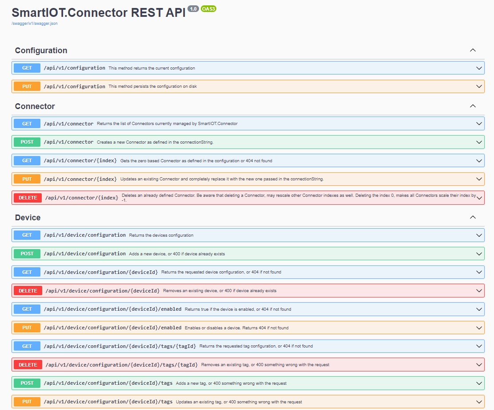

# SmartIOT.Connector REST API

This project implements the REST controllers that provide developers to interact with SmartIOT.Connector internals and change the configuration at runtime, by adding, modifiying and removing connectors and devices at any time.

To plug the controllers you just need to call an extension method to your AspNetCore builder, provided by class [AspNetCoreExtensions](AspNetCoreExtensions.cs):

```csharp
    var builder = WebApplication.CreateBuilder(args);

    // ...
    
    // Add api controllers and versioning
	builder.Services.AddSmartIotConnectorRestApi(new ConfigurationPersister(configuration, path));
```

See project [SmartIOT.Connector.ConsoleApp](../../Apps/SmartIOT.Connector.ConsoleApp/README.md) to see how that's done in details.

You can then use the Swagger API page to test your API calls:


