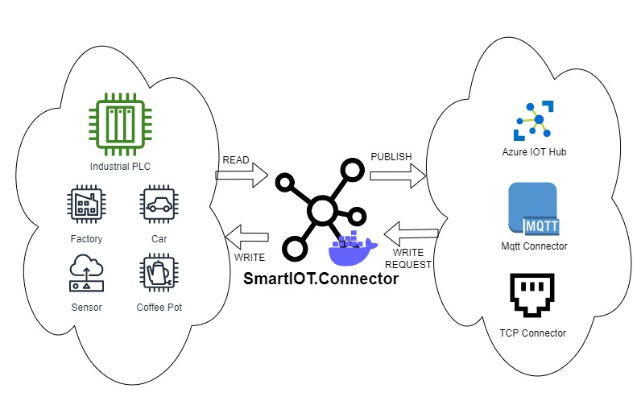

[](https://github.com/luca-domenichini/SmartIOT.Connector/actions/workflows/dotnet-release.yml)
[](https://www.nuget.org/packages/SmartIOT.Connector.Core/)
[](https://www.nuget.org/packages/SmartIOT.Connector.Core)
[](http://hits.dwyl.com/luca-domenichini/luca-domenichini/SmartIOTConnector)

# SmartIOT.Connector - Cloud Connector for IOT devices and industrial PLCs

This project aims at creating a simple connector and scheduler for automation devices, like industrial PLCs, publishing data to the cloud and more.



SmartIOT.Connector enables you to connect to a variety of IOT sensors and industrial PLCs** and distribute their data to an external system in form of an event describing the changed data.<br>
The external system can then process the data being read and can send back to SmartIOT.Connector data to be written to the devices.<br>
SmartIOT.Connector is a good fit for industrial and automation needs, where developers are being asked to abstract away from device communication protocols and must concentrate solely on the business logic to implement.

## Quick start

The following quick start creates an SmartIOT.Connector instance that connects to a device (namely a Siemens PLC) and reads 100 bytes from Tag 20.<br/>
Whenever a change is detected in the tag, a message is published to the Mqtt Server specified in the connection string below.<br/>
It also listens for incoming messages in topic `tagWrite` and tries to write data to tag 22.<br/>
For message formats, read the docs [here for project SmartIOT.Connector.Messages](./Core/SmartIOT.Connector.Messages/README.md). JSON serializer is used by default, but Protobuf can also be used, or even your own serializer.

1. Create a configuration json file (see [this file](./Docs/Configuration.md) for configuration reference):

```json
{
    "ConnectorConnectionStrings": [
        "mqttClient://Server=<IpAddress or hostname>;ClientId=MyClient;Port=1883"
    ],
    "DeviceConfigurations": [
        {
            "ConnectionString": "snap7://Ip=<IpAddress>;Rack=0;Slot=0;Type=PG",
            "DeviceId": "1",
            "Enabled": true,
            "Name": "Test Device",
            "IsPartialReadsEnabled": false,
            "IsWriteOptimizationEnabled": true,
            "Tags": [
                {
                    "TagId": "DB20",
                    "TagType": "READ",
                    "ByteOffset": 0,
                    "Size": 100,
                    "Weight": 1
                },
                {
                    "TagId": "DB22",
                    "TagType": "WRITE",
                    "ByteOffset": 0,
                    "Size": 100,
                    "Weight": 1
                }
            ]
        }
    ],
    "SchedulerConfiguration": {
        "MaxErrorsBeforeReconnection": 10,
        "RestartDeviceInErrorTimeoutMillis": 30000,
        "WaitTimeAfterErrorMillis": 1000,
        "WaitTimeBetweenEveryScheduleMillis": 0,
        "WaitTimeBetweenReadSchedulesMillis": 0,
        "TerminateAfterNoWriteRequestsDelayMillis": 3000,
        "TerminateMinimumDelayMillis": 0
    }
}
```

2. Use SmartIotConnectorBuilder to create the connector and run it:

```csharp
// Build SmartIOT.Connector and bind it to your DI container or wherever you can do this:
var smartiot = new SmartIOT.Connector.Core.SmartIotConnectorBuilder()
    .WithAutoDiscoverDeviceDriverFactories()
    .WithAutoDiscoverConnectorFactories()
    .WithConfigurationJsonFilePath("smartiot-config.json")
    .Build();

// Start SmartIOT.Connector whenever you need it to run
smartiot.Start();

// Stop SmartIOT.Connector before shutting down everything
smartiot.Stop();
```

otherwise, you can add SmartIOT.Connector to DI container with [these extension methods](./Core/SmartIOT.Connector.DependencyInjection/AspNetCoreExtensions.cs):

```csharp
// this method will start an IHostedService running SmartIOT.Connector
builder.Services.AddSmartIOTConnector(cfg =>
{
    // configure here.
    cfg.WithAutoDiscoverDeviceDriverFactories()
        .WithAutoDiscoverConnectorFactories()
        .WithConfigurationJsonFilePath("smartiot-config.json");
});

var app = builder.Build();

// you can configure further..
app.UseSmartIOTConnector(smartIotConnector =>
{
    smartIotConnector.AddPrometheus(conf); // for example, adding Prometheus here..
});
```

## Documentation

- [Configuration guide](./Docs/Configuration.md)
  - [Configure the devices](./Docs/Configuration.md#configuring-the-devices)
  - [Configure the connectors](./Docs/Configuration.md#configuring-the-connectors)
  - [Configure the scheduler main properties](./Docs/Configuration.md#configuring-the-scheduler-main-properties)
- Supported devices
  - [Snap7 PLC configuration guide](./Devices/SmartIOT.Connector.Plc.Snap7/README.md)
  - [S7Net PLC configuration guide](./Devices/SmartIOT.Connector.Plc.S7Net/README.md)
  - [SnapModBus device configuration guide](./Devices/SmartIOT.Connector.Plc.SnapModBus/README.md)
- [Connectors guide](./Docs/Connectors.md)
- [REST API guide](./Core/SmartIOT.Connector.RestApi/README.md)
- [Customization guide](./Docs/Customize.md)

## SmartIOT.Connector.App and Docker integration

If you want to run SmartIOT.Connector as a standalone application or as a Docker container, see project [SmartIOT.Connector.App](./Apps/SmartIOT.Connector.App/README.md) for further details.

Here is a quick link to the Docker image repository: <https://hub.docker.com/repository/docker/lucadomenichini/smartiot-connector-app>

## Run as a Windows Service

The application [SmartIOT.Connector.App](./Apps/SmartIOT.Connector.App/README.md) supports being run as a WinService.
All you need to do is install it and run.
Follow [this guide](https://learn.microsoft.com/en-us/dotnet/core/extensions/windows-service?pivots=dotnet-8-0#create-the-windows-service) for further informations

## Nuget packages

You can find SmartIOT.Connector packages on nuget.org site and on Visual Studio Package Manager:
<https://www.nuget.org/packages?q=SmartIOT.Connector>

## Credits

These libraries provide connectivity with underlying devices:

- Snap7 for Siemens S7 plc family, S7300, S71200, S71500 <http://snap7.sourceforge.net/>
- SnapModbus for devices on ModBus network <https://snapmodbus.sourceforge.io/>
- S7NetPlus for Siemens S7 plc family, S7300, S71200, S71500 <https://github.com/S7NetPlus/s7netplus> 

## Disclaimer

As of version 0.x, interfaces and implementation details are subject to change without notice.
I will do my best to keep the interfaces stable, but there are possibilities to incur in such breaking changes.

## Roadmap to 1.0 - Features TODO list

- [X] REST Api (included in default App project)
- [ ] GRPC Server Connector
- [X] TCP Server Connector
- [X] TCP Client Connector
- [ ] Web app with monitoring capabilities (included in default App project)
- [X] Nuget packages on nuget.org - <https://www.nuget.org/packages?q=SmartIOT.Connector>
- [X] Docker runner image on dockerhub - <https://hub.docker.com/repository/docker/lucadomenichini/smartiot-connector-app>
- [X] Apps
  - [X] Run SmartIOT.Connector as a console app
  - [X] Run SmartIOT.Connector as a Docker image
  - [X] Run SmartIOT.Connector as a WinService
- [ ] Testers: connector counterpart as WPF app
  - [ ] GRPC Client
  - [X] TCP client
  - [X] TCP server

## Docs TODO list

- [ ] Extensibility docs
- [ ] Comment public classes and interfaces

## Technical TODO list

- [ ] Leverage the async pattern for Devices:
      introduce `IAsyncDeviceDriver` and add support to autodiscover and run them
- [ ] The proto files should be part of SmartIOT.Connector.Messages project
- [ ] Build and push docker image with github workflow
- [ ] Reduce memory allocation on read/write operations. The aim is to use the underlying byte[] as source or target directly, without further allocations.
  - [ ] use existing ReadOnlySpan aware methods on S7Net
  - [ ] introduce new method ReadOnlySpan aware on Snap7 and SnapModBus
